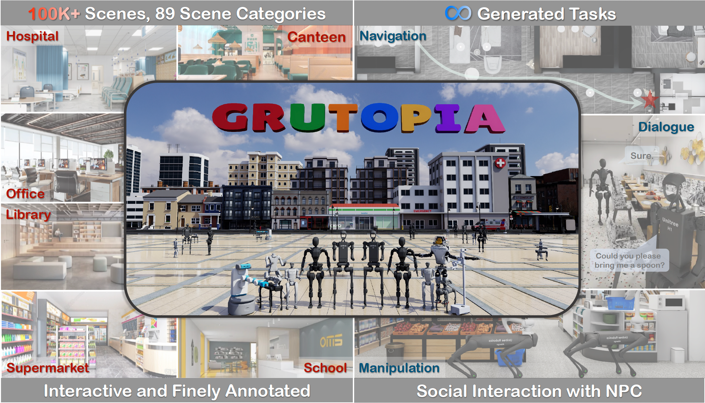

<br>
<p align="center">
<h1 align="center"><strong>GRUtopia: Dream General Robots in a City at Scale</strong></h1>
  <p align="center">
    <a href='https://github.com/OpenRobotLab' target='_blank'>OpenRobotLab</a>&emsp;
    <br>
    Shanghai AI Laboratory
    <br>
  </p>
</p>

<div id="top" align="center">

[]()
[](./assets/GRUtopia.pdf)
[](https://github.com/OpenRobotLab/GRUtopia)

</div>

## 🤖 [Demo](https://tai-wang.github.io/embodiedscan)

GRUtopia aka. Tao Yuan (桃源 in Chinese)

To add demo video link

<!-- <div style="text-align: center;">
    
</div> -->

[]()


## 📋 Contents

- [🏠 About](#-about) <!-- omit in toc -->
- [🔥 News](#-news)
- [📚 Getting Started](#-getting-started)
- [📦 Model and Benchmark](#-model-and-benchmark)
- [📝 TODO List](#-todo-list)
- [🔗 Citation](#-citation)
- [📄 License](#-license)
- [👏 Acknowledgements](#-acknowledgements)

## 🏠 About

<!--  -->

<div style="text-align: center;">
    
</div>
Recent works have been exploring the scaling laws in the field of Embodied AI. Given the prohibitive costs of collecting real-world data, we believe the <b>Simulation-to-Real (Sim2Real) paradigm</b> is a more feasible path for scaling the learning of embodied models.

We introduce project <b>GRUtopia</b>, the first simulated interactive 3D society designed for various robots.
It features several advancements: 
* 🏙️ <b>GRScenes</b>, the scene dataset, includes 100k interactive, finely annotated scenes, which can be freely combined into city-scale environments. In contrast to previous works mainly focusing on home, GRScenes covers 89 diverse scene categories, bridging the gap of <b>service-oriented environments</b> where general robots would initially be deployed.
* 🧑‍🤝‍🧑 <b>GRResidents</b>, a Large Language Model (LLM) driven Non-Player Character (NPC) system that is responsible for social interaction, task generation, and task assignment, thus simulating <b>social scenarios</b> for embodied AI applications.
* 🤖 <b>GRBench</b>, the benchmark, focuses on legged robots as primary agents and poses <b>moderately challenging</b> tasks involving Object Loco-Navigation, Social Loco-Navigation, and Loco-Manipulation.

We hope that this work can alleviate the scarcity of high-quality data in this field and provide a more comprehensive assessment of embodied AI research.

## 🔥 News

- \[2024-07\] We release the [paper](./assets/GRUtopia.pdf) and demos of GRUtopia.

## 📚 Getting Started

### Prerequisites

We test our codes under the following environment:

- Ubuntu 20.04, 22.04
- [NVIDIA Omniverse Isaac Sim 2023.1.1](https://docs.omniverse.nvidia.com/isaacsim/latest/installation/install_workstation.html)
  - Ubuntu 20.04/22.04 Operating System
  - NVIDIA GPU (RTX 2070 or higher)
  - NVIDIA GPU Driver (recommended version 525.85)
  - Docker (Optional)
  - NVIDIA Container Toolkit (Optional)
- Conda
  - Python 3.10.13 (3.10.* is ok, well installed automatically)

### Installation

We provide the installation guide [here](docs/en/get_started/installation.md). You can install locally or use docker and verify the installation easily.

### Demo

Following the installation guide, you can verify the installation by running:

```bash
python ./GRUtopia/demo/h1_locomotion.py  # start simulation
```

You can see a humanoid robot (Unitree H1) walking following a pre-defined trajectory in Isaac Sim.

### Wander the Demo Scenes

Referring to the [guide](docs/en/get_started/wander-in-city.md), you can basically run to wander a demo house:

```bash
# python ./GRUtopia/demo/h1_city.py will run a humanoid in the city block
# Its movement is much smaller given the large space of the block.
# Therefore, we recommend try with h1_house.py
python ./GRUtopia/demo/h1_house.py  # start simulation
```

You can control a humanoid robot to walk around in a demo house and look around from different views by changing the camera view in Isaac Sim (on the top of the UI).

BTW, you can also simply load the demo city USD file into Isaac Sim to freely sightsee the city block with keyboard and mouse operations supported by Omniverse.

### WebUI and NPC Demo

Please refer to the [guide](docs/en/get_started/web-demo.md) to try with WebUI and play with NPCs. Note that there are some additional requirements, such as installing with the docker and LLM's API keys.

### Customize Robots

Please refer to the [guide](docs/en/get_started/30-min-to-get-started.md) to get started with simple inference of a low-level control task on a newly added simple robot.

### Customize NPC

Please refer to the [guide](docs/en/tutorials/how-to-use-npc.md) to customize NPC with your algorithm.

### Documentation \& Tutorial

We provide detailed [docs](docs/env) and simple [tutorials](docs/en/tutorials/) for the basic usage of different modules supported in GRUtopia. Welcome to try and post your suggestions!

## 📦 Model and Benchmark

### Benchmark Overview

<p align="center">
  
</p>
An embodied agent is expected to actively perceive its environment, engage in dialogue to clarify ambiguous human instructions, and interact with its surroundings to complete tasks. Here, we preliminarily establish three benchmarks for evaluating the capabilities of embodied agents from different aspects: <b>Object Loco-Navigation</b>, <b>Social Loco-Navigation</b>, and <b>Loco-Manipulation</b>. The target object in the instruction are subject to some constraints generated by the world knowledge manager. Navigation paths, dialogues, and actions are depicted in the figure.

For now, please see the [paper](./assets/GRUtopia.pdf) for more details of our models and benchmarks. We are actively re-organizing the codes and will release them soon. Please stay tuned.

## 📝 TODO List

- \[x\] Release the paper with demos.
- \[x\] Release the platform with basic functions and demo scenes.
- \[ \] Release 100 curated scenes.
- \[ \] Release the baseline models and benchmark codes.
- \[ \] Polish APIs and related codes.
- \[ \] Full release and further updates.

## 🔗 Citation

If you find our work helpful, please cite:

```bibtex
@inproceedings{grutopia,
    title={GRUtopia: Dream General Robots in a City at Scale},
    author={Wang, Hanqing and Chen, Jiahe and Huang, Wensi and Ben, Qingwei and Wang, Tai and Mi, Boyu and Huang, Tao and Zhao, Siheng and Chen, Yilun and Yang, Sizhe and Cao, Peizhou and Yu, Wenye and Ye, Zichao and Li, Jialun and Long, Junfeng and Wang, ZiRui and Wang, Huiling and Zhao, Ying and Tu, Zhongying and Qiao, Yu and Lin, Dahua and Pang Jiangmiao},
    year={2024},
    booktitle={arXiv},
}
```

</details>

## 📄 License

GRUtopia's simulation platform is [MIT licensed](LICENSE). The open-sourced GRScenes are under the <a rel="license" href="http://creativecommons.org/licenses/by-nc-sa/4.0/">Creative Commons Attribution-NonCommercial-ShareAlike 4.0 International License</a><a rel="license" href="http://creativecommons.org/licenses/by-nc-sa/4.0/"></a>.

## 👏 Acknowledgements

- [OmniGibson](https://github.com/StanfordVL/OmniGibson): We refer to OmniGibson for designs of oracle actions.
- [RSL_RL](https://github.com/leggedrobotics/rsl_rl): We use `rsl_rl` library to train the control policies for legged robots.
- [ReferIt3D](https://github.com/referit3d/referit3d): We refer to the Sr3D's approach to extract spaitial relationship.
- [Isaac Lab](https://github.com/isaac-sim/IsaacLab): We use some utilities from Orbit (Isaac Lab) for driving articulated joints in Isaac Sim.
