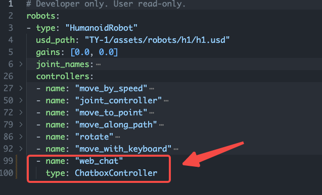

# How to add custom controller

> This tutorial will show you how to add a controller for a robot

Before this tutorial, you should read:
- [how to add robot](./how-to-add-robot.md)

## 1. Add `grutopia.core.robot.controller`

Take this "ChatboxController" as an example,

```python
from datetime import datetime
from typing import Any, Dict, List, Union

import numpy as np
from omni.isaac.core.scenes import Scene
from omni.isaac.core.utils.types import ArticulationAction

from grutopia.core.datahub.model_data import LogData, ModelData
from grutopia.core.robot.controller import BaseController
from grutopia.core.robot.robot import BaseRobot
from grutopia.core.config.robot import ControllerModel


@BaseController.register('ChatboxController')
class ChatboxController(BaseController):

    def __init__(self, config: ControllerModel, name: str, robot: BaseRobot, scene: Scene) -> None:
        config = ControllerModel(name=name, type='chat')
        super().__init__(config, robot, scene)
        self._user_config = None
        self.counter = 1

    def action_to_control(self, action: Union[np.ndarray, List]) -> ArticulationAction:
        # TODO Check input(like [np.array('I am the sentence', agent_avatar_data)])
        return self.forward(str(action[0]))

    def forward(self, chat: str) -> ArticulationAction:
        # TODO Set chat action
        return ArticulationAction()

    def get_obs(self) -> Dict[str, Any]:
        return {}
```

## 2. Register at `robot_models`

Like this.



## 3. Write a demo

```python
...
while env.simulation_app.is_running():
    ...
    env_actions = [{
        h1: {
            "web_chat": np.array(['你好'])
        }
    }]
    obs = env.step(actions=env_actions)
env.simulation_app.close()
```
