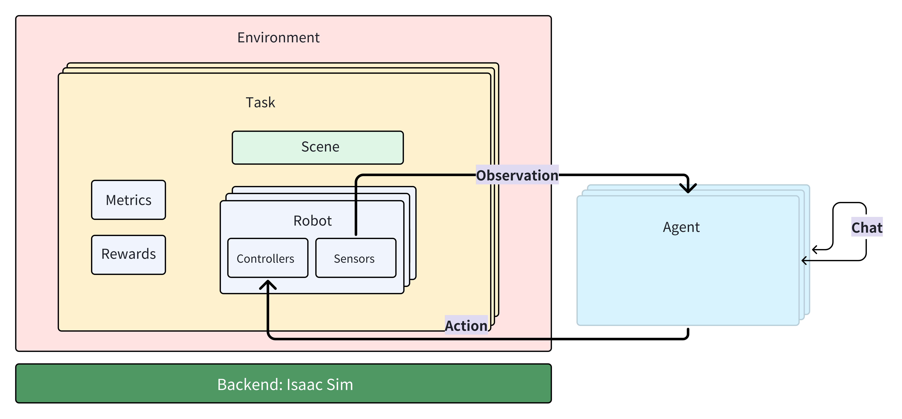

# How To Run Benchmark With Custom Agent

## Background

Currently, GRUtopia supports benchmark for social navigation and mobile manipulation.

You can download the dataset for both social navigation and mobile manipulation tasks by referring to this [doc]().

## System Requirements

1. NVIDIA's RTX-supported GPU
2. GPU memory should be greater than 16G
3. To run the entire benchmark, you will need at least 400GB of hard disk space (SSD is required)
4. 32GB of RAM is required.

> **Note**: We've tested our benchmarks on RTX 4090, and you can take it as a spec reference.

## Datasets

### Introduction for Social Navigation Dataset

Here is a brief introduction for some files in the datasets:

- benchmark/sn_episodes.json: episodes for social navigation task
- benchmark/meta/{scene_id}/model_mapping.json: name mapping from object name in scene to object's own name
- benchmark/meta/{scene_id}/object_dict_with_caption.json: object captions and relations in scene

### Introduction for Mobile Manipulation Dataset

Here is a brief introduction for some files in the datasets:

- benchmark/meta/{scene_id}/annotation.json: Polygons of room regions
- benchmark/mm_episodes.json: episodes for mobile manipulation task
- benchmark/meta/{scene_id}/paths.json: ground truth path to specific object from start point

## **Agent**

In GRUtopia, Agent is defined as the "brain" that receives observation and outputs action to control the robot's
movement. It has the following features

- Robot is not Agent
- Agent only interacts with the environment through Robot
- If there are multiple Agents, the interaction between Agents must be implemented separately outside GRUtopia (such as
  online chat)



The GRUtopia framework does not define an Agent base class. You can create your own Agent in any form.
You can also consider the following paradigm

Take demo/h1_locomation.py as an example. If you want to use an Agent to control the robot, you can consider making the
following changes

```python
...
# The module import part and the config and runtime definition parts are omitted above.

env = Env(sim_runtime)
obs, _ = env.reset()
# print(f'========INIT OBS{obs}=============')

path = [(1.0, 0.0, 0.0), (1.0, 1.0, 0.0), (3.0, 4.0, 0.0)]
i = 0

- move_action = {move_along_path_cfg.name: [path]}
+
import YouAgent

+ agent = YouAgent(you_agent_config)

while env.simulation_app.is_running():
    i += 1
    action = move_action
    action = agent.step(obs)
    obs, _, terminated, _, _ = env.step(action=action)
    if i % 500 == 0:
        print(i)
        # print(obs)

env.simulation_app.close()
```

## Agent Interface

As mentioned above, the use of an agent primarily involves computing the action based on the observation (obs), so it is
necessary to know the formats of both the observation and the action.

### To use Social Navigation Benchmark

the obs format received by your agent is as follows

```
# python dict structure
{
       "position": [ np.ndarray, 2D, 3 elements, XYZ ],
       "orientation": [ np.ndarray, 2D, 4 elements, Quaternions ],
       ...
       "sensors": {
             "camera": {
                    "bounding_box_2d_tight": {
                           ...
                    },
                    "landmarks": [],
                    "rgba": array([[]], dtype=uint8),
                    "depth": array([[]], dtype=float32),
                    "camera_params": {
                            ...
                     },
                    "pointcloud": array([[]])
                    },
             "tp_camera": {
                    ...
             },
       "render": False
}
```

the action should return from agent is as follows

```python
# Not every key needs to be returned, only the used keys are returned
{
    'h1': {
        'move_along_path': [[(1, 1, 1), (1, 2, 1)]],
        'rotate': [[Quaternions]],
        'terminate': False
    }
}
```

Among them:

1. `move_along_path` is to move along the point, input is the list in the example
2. `rotate` is to rotate, input is quaternion
3. `terminate` means the end instruction returned by the agent when it thinks the task has been completed, bool

### To use Mobile Manipulation Benchmark

the obs format received by your agent is as follows

```
# python dict structure
{
       "position": [ np.ndarray, 2D, 3 elements, XYZ ],
       "orientation": [ np.ndarray, 2D, 4 elements, Quaternions ],
       ...
       "sensors": {
             "camera": {
                    "bounding_box_2d_tight": {
                           ...
                    },
                    "landmarks": [],
                    "rgba": array([[]], dtype=uint8),
                    "depth": array([[]], dtype=float32),
                    "camera_params": {
                            ...
                     },
                    "pointcloud": array([[]])
                    },
             "tp_camera": {
                    ...
             },
       "render": False
}
```

the action should return from agent is as follows

```python
# Not every key needs to be returned, only the used keys are returned
{
    'h1': {
        'move_along_path': [[(1, 1, 1), (1, 2, 1)]],
        'rotate': [[Quaternions]],
        'terminate': False,
        'right_arm_ik_controller_cfg': [[3d_point]],
    }
}
```

Among them:

1. `move_along_path` is to move along the point, input is the list in the example
2. `rotate` is to rotate, input is quaternion
3. `terminate` means the end instruction returned by the agent when it thinks the task has been completed, bool

## Step

1. If necessary, start the agent service first (if your agent is implemented as a service call).
2. Generate the execution script for the episodes.
3. Run the execution script on any server that can run GRUtopia and has the assets downloaded. The only part that might
   be challenging is generating the execution script for the episodes.

### Generating Episodes

```shell
# It is recommended to execute this script at the root directory of the project.
python grutopia_extension.agents.social_navigation_agent.generate_sn_episodes.py --help
# or
python grutopia_extension.agents.mobile_manipulation_agent.generate_mm_episodes.py --help
```

You can learn how to use this episode generator by checking its help documentation.
