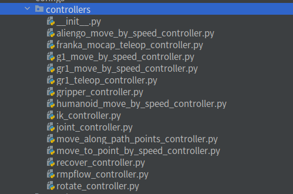

# How to Use Controller

> This tutorial will show you how to use existing controllers for robots.

## What Is Controller

Controllers typically manage the joints of a robot and serve as the entries to robot actions. We utilize controllers to make a robot move and run.

## Supported Controllers

The directory `grutopia_extension/config/controllers/` contains a list of all supported controllers:



## How to Use a Controller

We can utilize a controller in the main loop of the script, as shown below:

```Python
...
path = [(1.0, 0.0, 0.0), (1.0, 1.0, 0.0), (3.0, 4.0, 0.0)]
move_action = {move_along_path_cfg.name: [path]}

while env.simulation_app.is_running():
    env_action = move_action
    obs, _, _, _, _ = env.step(actions=env_actions)
    ...
env.simulation_app.close()
```

It is important to specify the controllers in the robot before use. Please refer to the [how to use robot](./how-to-use-robot.md) for more detailed information.
