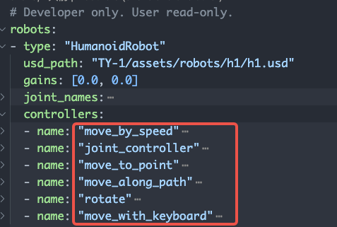

# How to use controller

> This tutorial will show you how to use an existed controller for a robot

## What is `Controller`

Controllers usually control joints of robot. Also, They're the entries of robot actions. To make robot move, rab, or
even speak, chat online, we use controllers.

## Which controllers are our robots supported

Check `grutopia_extension/robots/robot_models.yaml`,



This is all controller robot `HumanoidRobot` can use.

## How to use a controller

Use them in isaac simulation_app's step loops.

for example:

```Python
while env.simulation_app.is_running():
    actions = [{
        h1: {
            "move_to_point": np.array([.0, .0, .0]),
        },
    }]
    obs = env.step(actions=env_actions)
    ...
env.simulation_app.close()
```

for more usage, please read source code~
