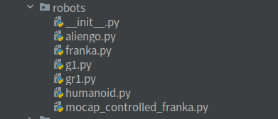

# How to Use Robot

> This tutorial will show you how to use an existing robot.

## Supported Robots

 The directory `grutopia_extension/config/robots/` contains a list of all supported robots:




## Robot Configuration
It is important to note that both controllers and sensors must operate in conjunction with the robot and cannot function independently. Only the controllers and sensors specified in the robot's configuration will be available for that robot.

 Let's take `HumanoidRobot` for instance, The file `grutopia_extension/config/robots/humaniod.py` lists all available controllers and sensors for `HumanoidRobot` as follows:
```python
...
move_by_speed_cfg = HumanoidMoveBySpeedControllerCfg(
   ...
)

move_to_point_cfg = MoveToPointBySpeedControllerCfg(
    ...
)

move_along_path_cfg = MoveAlongPathPointsControllerCfg(
   ...
)

rotate_cfg = RotateControllerCfg(
   ...
)

humanoid_camera_cfg = RepCameraCfg(name='camera', prim_path='logo_link/Camera', size=(640, 480))

humanoid_tp_camera_cfg = RepCameraCfg(name='tp_camera', prim_path='torso_link/TPCamera', size=(640, 480))
...
```
## How to Use a Robot
The following demonstration illustrates how to set up a robot configuration by adding controllers and sensors and how to integrate this configuration into a task. Once this is completed, the robot will be scheduled in the main loop of the script.

```python
h1_1 = HumanoidRobotCfg(
    controllers=[
        move_by_speed_cfg,
        move_along_path_cfg,
        rotate_cfg,
    ],
    sensors=[humanoid_camera_cfg.model_copy(update={'name': 'camera', 'size': (320, 240), 'enable': True}, deep=True)],
)

config = Config(
    simulator=SimConfig(physics_dt=1 / 240, rendering_dt=1 / 240, use_fabric=False),
    task_config=SingleInferenceTaskCfg(
        episodes=[
            SingleInferenceEpisodeCfg(
                scene_asset_path='GRUtopia/assets/scenes/empty.usd',
                scene_scale=[0.01, 0.01, 0.01],
                robots=[h1_1],
            ),
        ],
    ),
)
```
Please read `demo/h1_locomotion.py` for complete demo where a robot moves at a specified speed and direction.
