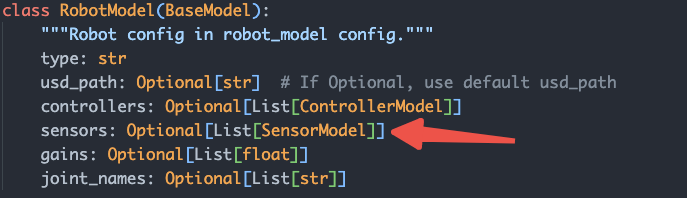

# How to use sensor

> This tutorial will show you how to use an existed sensors of robot


## Which sensors are our robots supported

In `grutopia/core/robot/robot_model.py`, We know `Sensors` is under `RobotModel`.



Check `grutopia_extension/robots/robot_models.yaml`. We find

```yaml
robots:
  - type: "HumanoidRobot"
    ...
    sensors:
      - name: "camera"  # <- this is sensor name
        prim_path: "relative/prim/path/to/camera"
        type: "Camera"
```

## How to use a sensor

When we run `demo/h1_locomotion.py`, observation from sensors can be got from `obs` (obs = env.step(actions=env_actions))

Use them in isaac simulation_app's step loops.

```Python
while env.simulation_app.is_running():
    ...
    obs = env.step(actions)
    task_name = env.active_runtimes.values()[0].name
    robot_name = env.active_runtimes.values()[0].robots.values()[0].name
    photo = obs[task_name][robot_name]['camera']['rgba']  # here get `camera` data
    ...
env.simulation_app.close()
```
