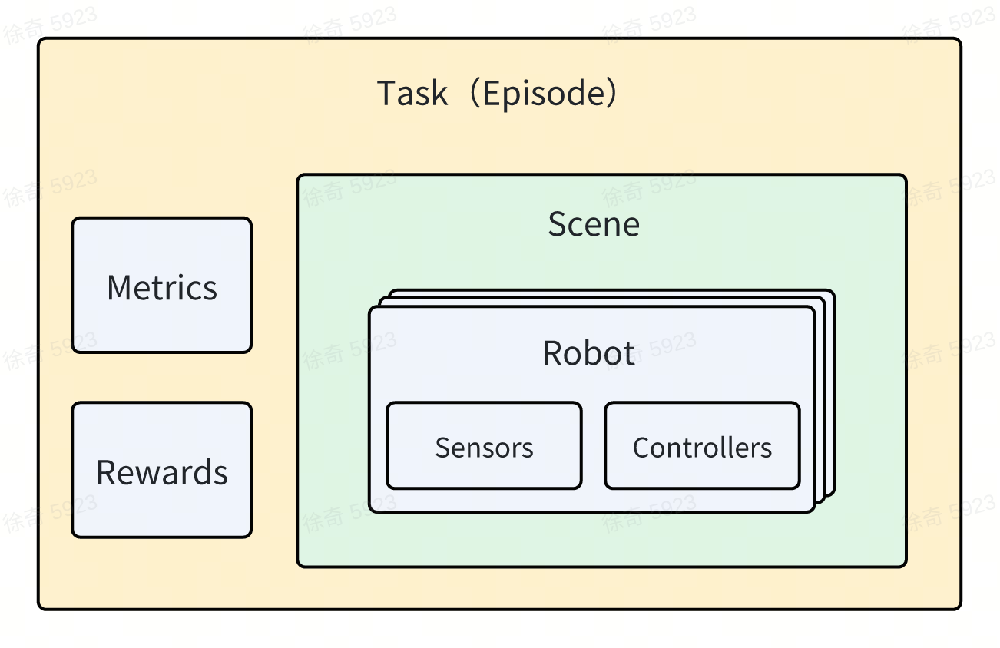

# How to Use Task

> This tutorial will show you how to use existing task.

## What Is Task

Task is a core concept within GRUtopia, defining what actions or objectives can be performed in a given environment. Each time a task is carried out, it is treated as an "Episode", which is a specific instance of the task's execution.



We have defined a base class for task along with several implementation subclasses.

## Supported Tasks

The directory `grutopia_extension/tasks/__init__.py` contains a list of all supported tasks:

```Python
from grutopia_extension.tasks import (
    manipulation_task,
    mobile_manipulation_task,
    object_navigation_task,
    finite_step_task,
    single_inference_task,
    social_navigation_task,
)
```
We can also review the configuration of each individual task in `grutopia_extension/config/tasks/__init__.py`


## How to Use a Task

 To use existing tasks within GRUtopia, you simply need to include them in the configuration settings as follows:

```Python
...
config = Config(
    simulator=SimConfig(physics_dt=1 / 240, rendering_dt=1 / 240, use_fabric=False),
    task_config=SingleInferenceTaskCfg(
        episodes=[
            SingleInferenceEpisodeCfg(
                scene_asset_path='GRUtopia/assets/scenes/empty.usd',
                scene_scale=[0.01, 0.01, 0.01],
                robots=[h1_1],
            ),
        ],
    ),
)
...
```

This configuration is excerpted from `demo/h1_locomotion.py`, which is a demo where a robot moves at a specified speed and direction. It is a task that consists of a single episode and does not terminate automatically, which is suitable for debugging the robot, controller, or sensor.
