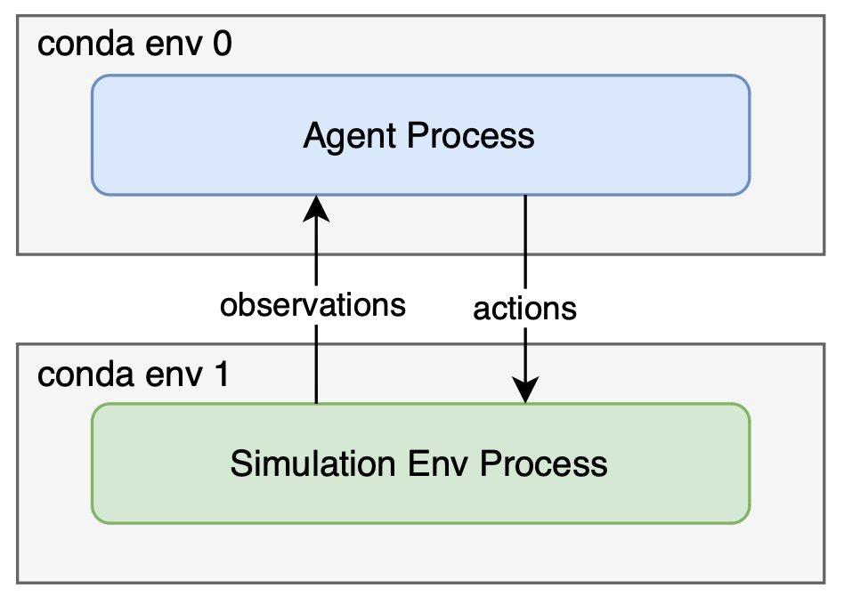

# Run Benchmark Baseline

NOTE: Benchmark baseline can only be run with the source code of GRUtopia currently. If GRUtopia is installed through pip, you must clone the repository of GRUtopia first.

```shell
$ git clone git@github.com:OpenRobotLab/GRUtopia.git
```

**Hardware requirements:**

1. At least 2 RTX-4090 on the same host (or other RTX GPU with equivalent VRAM resource).
2. 64GB+ RAM


## Overview

The system overview when running the benchmark baseline is as follows:



The agent runs as a separate process with its own python virtual environment, and currently it communicates with the simulation env process through HTTP localhost.

If you are running GRUtopia in a container, a separate container is recommended for running the agent, and make sure they are in the same network namespace (that is, the containers can connect to each other through localhost).

For social-navigation/mobile-manipulation benchmark, both the agent process and simulation env process require 16GB+ VRAM separately. We've tested them on a host with 2 RTX 4090 equipped, one for the baseline agent process and one for the simulation env process, and you can take it as a spec reference.

Generally, running benchmark with our agent baseline including the following steps:

1. Start the baseline agent process.
2. Generate config for all episodes.
3. Run all episodes in simulation.

***
**NOTE**: Agents implementations are currently in the directory [`GRUtopia/grutopia_extension/agents/`](https://github.com/OpenRobotLab/GRUtopia/tree/main/grutopia_extension/agents). They may be migrated to a separate repo in the future.

## Social Navigation

### 1 Start Baseline Agent For Social Navigation Benchmark

#### 1.1 Install Dependencies for Agent

Create a new conda/venv env (for agent), and then install the dependencies within the env:

```shell
# Make sure your CUDA toolkit version matches your pytorch cuda version
# CUDA is required, and you should specify CUDA installation path
# with `export CUDA_HOME=/path/to/cuda`
cd grutopia_extension/agents/social_navigation_agent
pip install -r requirements.txt
```

Tmux is required for running the agent entrypoint script. You can install it by:

```shell
sudo apt update
sudo apt install tmux
```

#### 1.2 Install Submodules

```shell
# PWD: grutopia_extension/agents/social_navigation_agent
mkdir images
# Please make sure your torch cuda version is equal with your cuda version
# GroundingDINO
git clone https://github.com/IDEA-Research/GroundingDINO.git

# YOLOv7
git clone https://github.com/WongKinYiu/yolov7.git
```

The directory structure of the submodules is as follows:

```
grutopia_extension
├── agents
│   ├── social_navigation_agent
│   │   ├── GroundingDINO                            # GroundingDINO repo
│   │   ├── images                                   # Empty directory
│   │   └── yolov7                                   # yolov7 repo
```


#### 1.3 Download Model Weights

```shell
# PWD: grutopia_extension/agents/social_navigation_agent
mkdir data
cd data
```

Download the necessary model weights from the provided sources and place them in an accessible directory within the
project, put them under the data folder. These weights are essential for running the models.

- MobileSAM: Download mobile_sam.pt from the [MobileSAM GitHub Repository](https://github.com/ChaoningZhang/MobileSAM/blob/master/weights/mobile_sam.pt).
- GroundingDINO: Download groundingdino_swint_ogc.pth from
  the [GroundingDINO GitHub Repository](https://github.com/IDEA-Research/GroundingDINO/releases/download/v0.1.0-alpha/groundingdino_swint_ogc.pth).
- YOLOv7: Download yolov7-e6e.pt from the [YOLOv7 GitHub Repository](https://github.com/WongKinYiu/yolov7/releases/download/v0.1/yolov7-e6e.pt).

```
grutopia_extension
├── agents
│   ├── social_navigation_agent
│   │   ├── data
│   │   │   ├── groundingdino_swint_ogc.pth
│   │   │   ├── mobile_sam.pt
│   │   │   └── yolov7-e6e.pt
```

#### 1.4 Configure API Keys

Put your API keys under `./modules/vlm/api_key`.

```
grutopia_extension
├── agents
│   ├── social_navigation_agent
│   │   ├── modules
│   │   │   └── vlm
│   │   │   │   └── api_key
│   │   │   │   │   ├── azure_api_key.txt
│   │   │   │   │   └── azure_api_key_e.txt
```

As mentioned above:
- `azure_api_key.txt`: The API key for the Azure OpenAI `gpt-4o` model.
- `azure_api_key_e.txt`: The API key for the Azure OpenAI `text-embedding-3-large` embedding model.

You can learn how to get the keys through this [link](https://learn.microsoft.com/zh-cn/azure/ai-services/openai/concepts/models?tabs=global-standard%2Cstandard-chat-completions).


#### 1.5 Run the Agent Process

Launch the agent process

```shell
# PWD: grutopia_extension/agents/social_navigation_agent
./scripts/launch_vlm_servers.sh
```

### 2. Generate episodes config for social navigation task

A python script [`generate_sn_episodes.py`](https://github.com/OpenRobotLab/GRUtopia/blob/main/grutopia_extension/agents/social_navigation_agent/generate_sn_episodes.py) is provided to generate episodes config for social navigation task. Currently it generates a python entrypoint file for each episode, since our env does not fully support multiple episodes yet. For example, if there's 30 episodes to run for the benchmark, 30 python scripts will be generated, and each python script contains the full process to run one episode in simulation Env.

```shell
# generate episodes config for social navigation task
cd PATH/TO/GRUTOPIA/ROOT
cd ..
python GRUtopia/grutopia_extension/agents/social_navigation_agent/generate_sn_episodes.py --help  # See options when generating episodes config
python GRUtopia/grutopia_extension/agents/social_navigation_agent/generate_sn_episodes.py
```

If no options are provided, the generated scripts will be saved in `./sn_episodes`. You can override the path when generating (see `--help`).

### 3 Run the Episodes in Simulation Env

Open a new session and switch to the python virtual environment for simulation env, which is the one you created when [install GRUtopia](installation.md).

First install the dependencies required for running the benchmark:

```shell
cd PATH/TO/GRUTOPIA/ROOT
pip install -r requirements/benchmark.txt
```

It may take quite a long time to run all the episodes. You can verify the setting by running the demo episode first:

```shell
cd PATH/TO/GRUTOPIA/ROOT
cd ..
python GRUtopia/grutopia/demo/h1_social_navigation.py
```

If the demo episode runs successfully, you can run all the episodes in the benchmark by running all the python scripts generated in step 2. The scripts can also be distributed to different machines and run in parallel as long as the agent process is started on these machines (since currently the two processes can only communicated through localhost...).

Currently, the process and logic of running benchmark baseline is quite rough, and we are continuously working on optimizing it.

## Mobile Manipulation

### 1 Start Baseline Agent For Mobile Manipulation Benchmark

#### 1.1 Install Environment Dependencies

Create a new conda/venv env (for agent), and then install the dependencies within the env:

```shell
# Make sure your CUDA toolkit version matches your pytorch cuda version
# CUDA is required, and you should specify CUDA installation path
# with `export CUDA_HOME=/path/to/cuda`
cd grutopia_extension/agents/mobile_manipulation_agent
pip install -r requirements.txt
```

Tmux is required for running the agent entrypoint script. You can install it by:

```shell
sudo apt update
sudo apt install tmux
```

#### 1.2 Install Submodules

```shell
# PWD: grutopia_extension/agents/mobile_manipulation_agent
mkdir images
# Please make sure your torch cuda version is equal with your cuda version
# GroundingDINO
git clone https://github.com/IDEA-Research/GroundingDINO.git

# YOLOv7
git clone https://github.com/WongKinYiu/yolov7.git
```

The directory structure of the submodules are as follows:

```
grutopia_extension
├── agents
│   ├── mobile_manipulation_agent
│   │   ├── GroundingDINO                            # GroundingDINO repo
│   │   ├── images                                   # Empty directory
│   │   └── yolov7                                   # yolov7 repo
```

#### 1.3 Download Model Weights

```shell
# PWD: grutopia_extension/agents/mobile_manipulation_agent
mkdir data
cd data
```

Download the necessary model weights from the provided sources and place them in an accessible directory within the
project, put them under data folder. These weights are essential for running models.

- MobileSAM: Download mobile_sam.pt from the [MobileSAM GitHub Repository](https://github.com/ChaoningZhang/MobileSAM/blob/master/weights/mobile_sam.pt).
- GroundingDINO: Download groundingdino_swint_ogc.pth from
  the [GroundingDINO GitHub Repository](https://github.com/IDEA-Research/GroundingDINO/releases/download/v0.1.0-alpha/groundingdino_swint_ogc.pth).
- YOLOv7: Download yolov7-e6e.pt from the [YOLOv7 GitHub Repository](https://github.com/WongKinYiu/yolov7/releases/download/v0.1/yolov7-e6e.pt).

**NOTE**: Ensure these files are saved in a directory where the code can access them.

```
grutopia_extension
├── agents
│   ├── mobile_manipulation_agent
│   │   ├── data
│   │   │   ├── groundingdino_swint_ogc.pth
│   │   │   ├── mobile_sam.pt
│   │   │   └── yolov7-e6e.pt
```

#### 1.4 Configure API Key

Put your api key under `./modules/vlm/api_key`.

```
grutopia_extension
├── agents
│   ├── mobile_manipulation_agent
│   │   ├── modules
│   │   │   └── vlm
│   │   │   │   └── api_key
│   │   │   │   │   ├── azure_api_key.txt
│   │   │   │   │   └── azure_api_key_e.txt
```

As mentioned above:
- `azure_api_key.txt`: The API key for the Azure OpenAI `gpt-4o` model.
- `azure_api_key_e.txt`: The API key for the Azure OpenAI `text-embedding-3-large` embedding model.

You can learn how to get the keys through this [link](https://learn.microsoft.com/zh-cn/azure/ai-services/openai/concepts/models?tabs=global-standard%2Cstandard-chat-completions).


#### 1.5 Run the Agent Process

Launch the agent process

```shell
# PWD: grutopia_extension/agents/mobile_manipulation_agent
./scripts/launch_vlm_servers.sh
```

### 2 Generate episodes config for mobile manipulation task

A python script [`generate_mm_episodes.py`](https://github.com/OpenRobotLab/GRUtopia/blob/main/grutopia_extension/agents/mobile_manipulation_agent/generate_mm_episodes.py) is provided to generate episodes config for mobile manipulation task. Currently it generates a python entrypoint file for each episode, since our env does not fully support multiple episodes yet. For example, if there's 30 episodes to run for the benchmark, 30 python scripts will be generated, and each python script contains the full process to run one episode in simulation Env.

```shell
# generate episodes config for mobile manipulation task
cd PATH/TO/GRUTOPIA/ROOT
cd ..
python GRUtopia/grutopia_extension/agents/mobile_manipulation_agent/generate_mm_episodes.py --help  # See options when generating episodes config
python GRUtopia/grutopia_extension/agents/mobile_manipulation_agent/generate_mm_episodes.py
```

If no options are provided, the generated scripts will be saved in `./mm_episodes`. You can override the path when generating (see `--help`).


### 3 Run the Episodes in Simulation Env

Open a new session and switch to the python virtual environment for simulation env, which is the one you created when [install GRUtopia](installation.md).

First install the dependencies required for running the benchmark:

```shell
cd PATH/TO/GRUTOPIA/ROOT
pip install -r requirements/benchmark.txt
```

It may take quite a long time to run all the episodes. You can verify the setting by running the demo episode first:

```shell
cd PATH/TO/GRUTOPIA/ROOT
cd ..
python GRUtopia/grutopia/demo/mobile_manipulation.py
```

If the demo episode runs successfully, you can run all the episodes in the benchmark by running all the python scripts generated in step 2. The scripts can also be distributed to different machines and run in parallel as long as the agent process is started on these machines (since currently the two processes can only communicated through localhost...).

Currently, the process and logic of running benchmark baseline is quite rough, and we are continuously working on optimizing it.

## FAQ

- Following error may occur in GroundingDINO:

    ```
    name _C is not defined
    ```

  This is because the GroundingDINO is not properly installed. GroundingDINO depends on CUDA and you should specify the CUDA installation path with `export CUDA_HOME=<your cuda path>` when install GroundingDINO (`pip install -r requirements.txt`).
